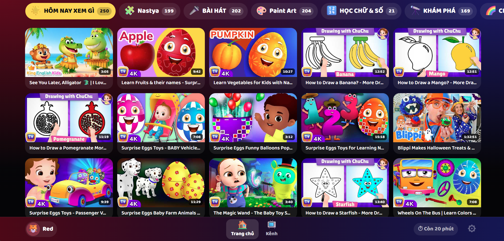
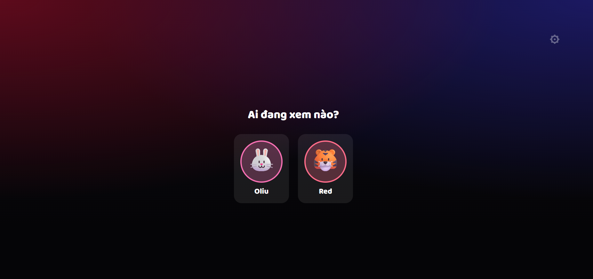
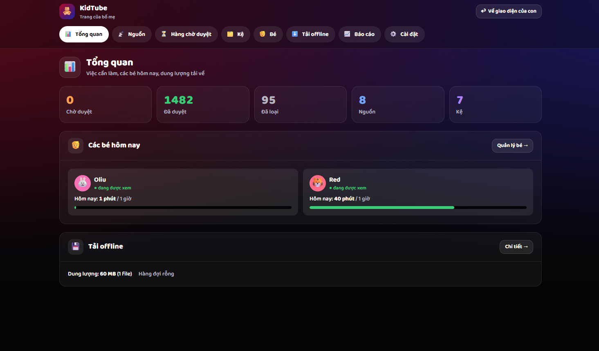
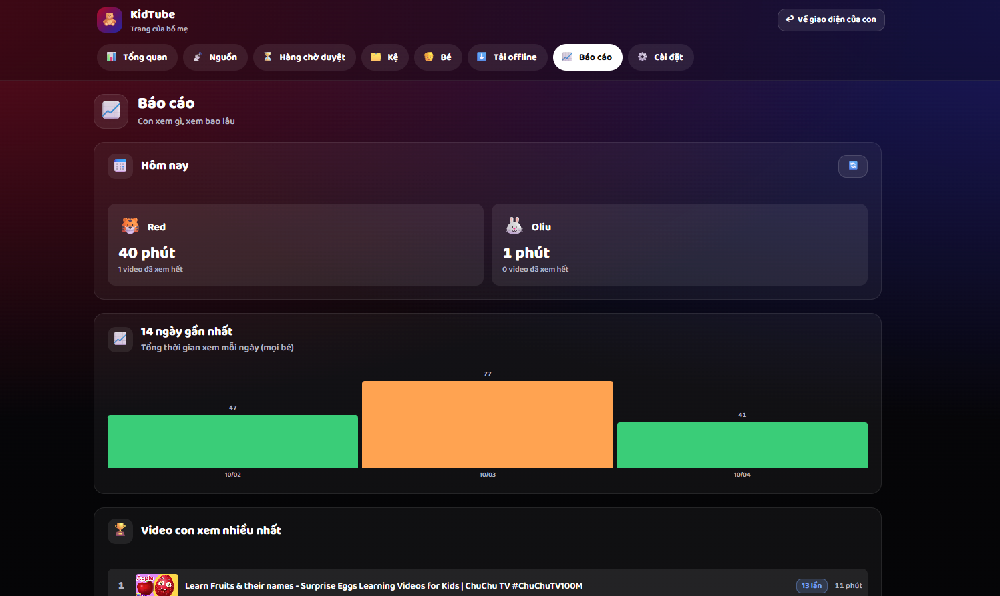
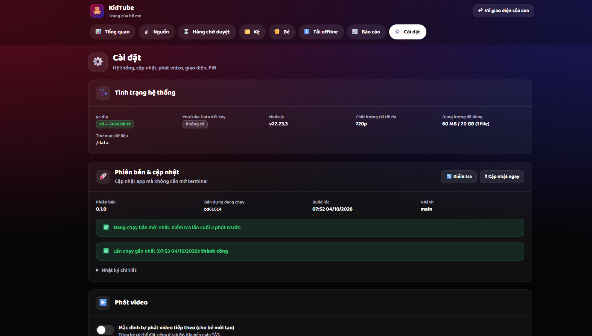
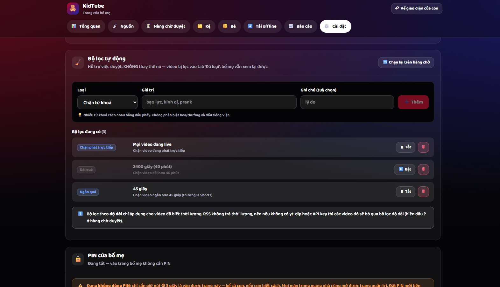

# KidTube Home 🧸

YouTube an toàn cho con, chạy trên homelab của chính bạn. Giao diện kiểu
YouTube Kids, nhưng **con chỉ thấy đúng những video bố mẹ đã bấm duyệt**.

Không thuật toán. Không đề xuất. Không hố thỏ.

📖 Tài liệu: [Yêu cầu gốc](docs/REQUIREMENTS.md) · [Kế hoạch](docs/PLAN.md) ·
[Kiến trúc](docs/ARCHITECTURE.md) · [Thiết kế](docs/DESIGN.md)

---

## Giao diện

### Của con



**Trang chủ.** Mỗi kệ là một nút chủ đề ở hàng trên cùng, con số bên cạnh là
số video trong kệ. Thumbnail to, chữ ít, bấm là xem. Thanh dưới có bé đang
xem, hai nút Trang chủ / Kênh, đồng hồ "Còn 20 phút", và nút ⚙ dành cho bố mẹ
(phải giữ 3 giây mới vào được).

<p align="center">
  
</p>

**Chọn bé.** Mỗi bé một avatar con vật, không cần mật khẩu. Giới hạn thời gian
và kệ được xem tính riêng cho từng bé.

### Của bố mẹ

<table>
  <tr>
    <td width="50%" valign="top">
      
      <p><b>Tổng quan</b>: số video chờ duyệt / đã duyệt / đã loại, các bé hôm
      nay đã xem bao lâu so với giới hạn, dung lượng video tải về.</p>
    </td>
    <td width="50%" valign="top">
      
      <p><b>Báo cáo</b>: hôm nay từng bé xem bao nhiêu phút, biểu đồ 14 ngày,
      những video con xem nhiều nhất.</p>
    </td>
  </tr>
  <tr>
    <td width="50%" valign="top">
      
      <p><b>Cài đặt</b>: tình trạng hệ thống (yt-dlp, dung lượng) và cập nhật
      app bằng một cú bấm, không cần SSH vào Pi.</p>
    </td>
    <td width="50%" valign="top">
      
      <p><b>Bộ lọc tự động</b>: chặn theo từ khoá, video quá dài, quá ngắn
      (Shorts), video đang live. Video bị lọc vào tab "Đã loại", bố mẹ vẫn xem
      lại được.</p>
    </td>
  </tr>
</table>

<sub>Ảnh chụp từ một bản cài thật. Thumbnail video thuộc về các kênh YouTube tương ứng.</sub>

---

## Nó hoạt động thế nào

```
Bố mẹ dán link kênh  →  hệ thống kéo video về HÀNG CHỜ DUYỆT
                     →  bố mẹ bấm ✅ từng video
                     →  xếp vào KỆ
                     →  con mới thấy
```

**Hai tầng cửa:** video phải `đã duyệt` **và** nằm trong một kệ đang bật.
Duyệt xong mà chưa xếp kệ thì con vẫn chưa thấy — cố ý như vậy.

Video mới của kênh **không bao giờ tự lên kệ**. Kênh hôm nay lành mạnh,
tháng sau đăng gì bạn không kiểm soát được.

## Tính năng

**Cho con**
- Chọn bé bằng avatar con vật, không mật khẩu
- Kệ ngang cuộn được, thumbnail to, chữ ít
- Hoạt động cả **cảm ứng (tablet)** và **remote (TV LG)**
- Tab Kênh: xem ngẫu nhiên video đã duyệt, lọc theo kênh
- Kính lúp 🔍 ở Trang chủ và Kênh: gõ tới đâu hiện video tới đó, không cần
  dấu, video sát nhất lên đầu — cho bé biết chữ hoặc bố mẹ tìm giúp
- Không thoát ra YouTube được: overlay chặn 100% click vào iframe

**Cho bố mẹ**
- Dán link bất kỳ dạng nào: `@handle`, `/channel/UC…`, `/c/`, `/user/`,
  playlist, `youtu.be`, Shorts, hoặc mã kênh thô
- Xem trước nguồn trước khi thêm
- Duyệt hàng loạt, xếp kệ kéo thứ tự
- Giới hạn: phút/ngày, phút/lượt, số video/lượt, khung giờ
- Cấp thêm giờ / dừng lượt xem ngay từ trang quản trị
- Bộ lọc tự động (từ khoá tiếng Việt có dấu, độ dài, chặn live)
- Tải video về máy — sạch quảng cáo, xem được khi mất mạng
- Báo cáo: biểu đồ 14 ngày, video xem nhiều nhất, nhật ký xem

---

## Cài trên Raspberry Pi 5

Cần Docker và Docker Compose. Nếu chưa có:

```bash
curl -fsSL https://get.docker.com | sh
sudo usermod -aG docker $USER   # đăng xuất rồi vào lại
```

Cài app:

```bash
git clone <repo> kidtube && cd kidtube

# Bí mật ký cookie — không có thì mỗi lần restart phải nhập PIN lại
echo "SESSION_SECRET=$(openssl rand -hex 32)" > .env

# Cổng trên Pi. Mặc định 8477 — đổi nếu trùng với thứ khác trong homelab.
echo "KIDTUBE_PORT=8477" >> .env

# Bật nút "Cập nhật App" trong trang Cài đặt, khỏi phải SSH vào Pi sau này.
# Bỏ hai dòng này nếu bạn không muốn cấp quyền docker cho app — xem mục
# "Cập nhật app" bên dưới để biết đánh đổi là gì.
echo "KIDTUBE_REPO_DIR=$PWD" >> .env
echo "COMPOSE_PROFILES=updater" >> .env

docker compose up -d --build
docker compose logs -f kidtube
```

Nếu báo `port is already allocated`, xem cổng nào đang bị chiếm rồi chọn cổng khác:

```bash
ss -tlnp | grep -E ':(80|8[0-9]{3})'   # xem đang có gì
sed -i 's/^KIDTUBE_PORT=.*/KIDTUBE_PORT=8478/' .env
docker compose up -d
```

Lần build đầu mất khoảng **2 phút** trên Pi 5 (đã đo thực tế: 123s — chủ yếu là
biên dịch `better-sqlite3` cho arm64). Các lần sau nhanh hơn nhờ cache layer.

Mở `http://<ip-của-pi>:8477` → giữ icon ⚙ 3 giây → nhập PIN **`000000`**.

Đó là PIN mặc định lần đầu, cố tình để dễ nhớ. Vào được rồi thì *Cài đặt →
Đổi PIN* — trang quản trị sẽ nhắc cho tới khi bạn đổi. Muốn đặt PIN khác
ngay từ lần khởi tạo đầu tiên thì thêm `DEFAULT_PIN=…` vào `.env` **trước**
lần chạy đầu (sau đó biến này không còn tác dụng — PIN đã nằm trong CSDL).

Không muốn dùng PIN (máy chỉ bố mẹ cầm, con còn quá nhỏ)? *Cài đặt → PIN của
bố mẹ → Không dùng PIN nữa* (phải nhập PIN hiện tại để xác nhận). Từ đó giữ ⚙
3 giây là vào thẳng — nhưng mọi máy trong mạng nhà cũng mở được trang quản
trị. Bật lại bằng cách đặt PIN mới ở cùng chỗ; mọi thiết bị đang đăng nhập sẽ
bị đăng xuất.

(Thay `8477` bằng giá trị `KIDTUBE_PORT` của bạn. Cổng *bên trong* container
luôn là 8080 — không cần đổi.)

### Dùng SSD ngoài cho video tải về

Video 720p khoảng 40–80 MB mỗi cái. Đừng để trên thẻ microSD — thẻ sẽ chết sớm.

```yaml
# docker-compose.yml
volumes:
  - ./data:/data
  - /mnt/ssd/kidtube-media:/media # ← sửa dòng này
```

### Sao lưu

Toàn bộ cấu hình nằm trong **một file**:

```bash
docker compose stop kidtube
cp data/kid.db ~/backup/kid-$(date +%F).db
docker compose start kidtube
```

---

## Mở trên tablet (Android / iPad)

1. Mở `http://<ip-của-pi>:8477` bằng Chrome hoặc Safari
2. Menu → **Thêm vào Màn hình chính**
3. Mở từ icon vừa tạo → chạy **toàn màn hình, không có thanh địa chỉ**

Thanh địa chỉ bị ẩn nghĩa là con **không thoát ra trình duyệt được** — đây là
lớp bảo vệ quan trọng nhất trên tablet.

Muốn khoá chặt hơn nữa (Android): dùng **Fully Kiosk Browser** hoặc
**Screen Pinning** (Cài đặt → Bảo mật → Ghim màn hình).

---

## Mở trên TV LG (webOS)

1. Mở app **Web Browser** trên TV
2. Vào `http://<ip-của-pi>:8477`
3. Lưu vào Bookmark cho lần sau
4. Bấm chọn avatar của bé — app sẽ **tự xin vào toàn màn hình**

### Đặt chế độ TV cho đúng

Chữ và card sẽ to hơn 1.4× và có viền an toàn 5% chống overscan.

App tự nhận diện, nhưng nếu sai: mở **ngay trên TV** → vào trang bố mẹ →
**Cài đặt → Giao diện → Ghi đè chỉ trên THIẾT BỊ NÀY → TV**.

### Điều khiển bằng remote

| Nút | Tác dụng |
|---|---|
| ▲▼◀▶ | Di chuyển giữa các video (theo vị trí trên màn hình) |
| OK | Chọn |
| ◀ ▶ *khi đang xem* | Tua lùi / tiến 10 giây |
| ▲ ▼ *khi đang xem* | Tăng / giảm âm lượng |
| Back | Về trang chủ |

Magic Remote dùng con trỏ cũng được — app hỗ trợ cả hai cách.

### ⚠️ Hạn chế trên TV — đọc kỹ

**webOS không cài được PWA.** Nghĩa là con **vẫn có thể bấm Home/Back trên
remote để ra khỏi app**. Không có cách nào chặn từ phía web.

Bù lại bằng khoá của chính TV: **Cài đặt → Chung → An toàn → Khoá ứng dụng**,
khoá các app khác lại.

**Nhiều kênh trẻ em lớn chặn nhúng video ra ngoài YouTube** (Cocomelon là một
ví dụ). App tự phát hiện và ẩn những video đó khỏi giao diện của con, đồng thời
báo cho bạn trong tab *Hàng chờ duyệt*. **Cách khắc phục duy nhất là bật chế độ
tải offline** — file mp4 phát trực tiếp thì không cần nhúng.

Vì vậy với TV, nên bật **Cài đặt → Tải video về máy**.

---

## Cập nhật app

Trong *Cài đặt → Phiên bản & cập nhật* có nút **⬆ Cập nhật ngay**: nó chạy
`git pull` rồi dựng lại container, hiện tiến độ và tự tải lại trang khi xong.
Không phải mở terminal.

Nút này cần service phụ `kidtube-updater` (đã có sẵn trong `docker-compose.yml`,
mặc định TẮT). Bật bằng hai dòng trong `.env` — có trong phần cài đặt ở trên,
hoặc thêm sau:

```bash
cd ~/kidtube                       # thư mục đã git clone
echo "KIDTUBE_REPO_DIR=$PWD" >> .env
echo "COMPOSE_PROFILES=updater" >> .env
docker compose up -d
```

**Vì sao phải cần container phụ:** container KidTube không thể tự dựng lại
chính nó — bên trong nó không có git, không có docker CLI, cũng không có mã
nguồn. Và ngay cả khi có, nó sẽ tự giết mình ở giữa chừng. Container phụ đứng
ngoài nên chạy trọn vẹn được.

**Đánh đổi, đọc trước khi bật:** container phụ mount `/var/run/docker.sock`,
tức là nó có quyền ngang root trên Pi. Nó chỉ chạy đúng một script cố định
([scripts/updater.sh](scripts/updater.sh)) và không mở cổng mạng nào, nhưng đây
vẫn là một sự nới lỏng thật sự. Không thoải mái thì đừng bật — trang Cài đặt sẽ
hiện sẵn lệnh cần gõ, và bạn cập nhật bằng tay như thường:

```bash
cd ~/kidtube && git pull && docker compose up -d --build
```

Vài điều nên biết:

- **Thư mục cài đặt có thay đổi chưa commit thì nút bị chặn** — để không xoá
  mất thứ bạn sửa tay. Xử lý trên Pi rồi bấm lại.
- Cập nhật sẽ **ngắt video con đang xem**. Hộp thoại xác nhận có cảnh báo nếu
  đang có bé xem dở.
- Job tải offline dở dang được đưa về hàng đợi và chạy lại sau khi khởi động
  lại — không mất.
- Repo riêng tư cần git có sẵn thông tin đăng nhập trên Pi (SSH key hoặc
  credential helper); repo công khai thì không cần gì.
- Dữ liệu (`data/`) và video (`media/`) không bị động tới.

---

## Chế độ tải offline

Mặc định **TẮT**. Bật ở *Cài đặt → Tải video về máy*.

**Bật công tắc thôi chưa tải gì cả** — nó chỉ cho phép hàng đợi chạy. Bạn vẫn
phải chỉ ra video nào cần tải, bằng một trong hai cách:

- *Hàng chờ duyệt* → thẻ **Đã duyệt** → bấm **⬇** ngay dưới video.
- Chọn nhiều video rồi bấm **⬇ Tải offline** ở thanh thao tác phía trên.

Tiến độ xem ở tab *Tải offline*. Worker chạy mỗi 30 giây, nhưng khi bạn bấm nút
thì nó chạy ngay.

Lợi ích:
- **Không quảng cáo** (nhúng iframe thì vẫn có)
- Mở là phát ngay, không buffer
- Mất mạng vẫn xem được
- Xem được video mà kênh chặn nhúng
- Không gọi ra Google → không theo dõi con bạn

Cơ chế: `yt-dlp` tải 720p về `/media`, **một video một lúc** (Pi ghi SSD qua
USB3, chạy song song sẽ nghẽn và ảnh hưởng video đang phát). Vượt hạn mức dung
lượng thì tự xoá video ít xem nhất trước.

Định dạng tải về ưu tiên **H.264 + AAC**, không phải bản nhỏ nhất. Để mặc định
thì yt-dlp chọn AV1 + Opus, nhẹ hơn gần một nửa, nhưng TV LG phát bằng trình
phát sẵn của webOS thì chịu chết — mà đó lại chính là lý do tồn tại của chế độ
offline. File to hơn, đổi lại là bấm vào phát được ở mọi chỗ.

Về mặt điều khoản YouTube, tải xuống là vùng xám. Ở phạm vi dùng riêng trong
nhà thì bạn tự cân nhắc — đó là lý do mặc định để tắt.

### Khi yt-dlp hỏng

YouTube thay đổi kỹ thuật vài tháng một lần. Cách nhanh nhất, chữa tạm cho tới
lần dựng lại image:

```bash
docker compose exec kidtube pip3 install --break-system-packages -U "yt-dlp[default]"
docker compose restart kidtube
```

Bền hơn: đặt `YTDLP_VERSION` trong `.env` rồi dựng lại bằng
`docker compose up -d --build`. Đừng sửa `Dockerfile` — thư mục cài đặt có thay
đổi chưa commit sẽ chặn nút cập nhật.

**Nút ⬆ Cập nhật ngay không làm thay bước này.** Nút đó chỉ dựng lại image khi
`git pull` kéo về commit mới; sửa `.env` không tạo ra commit nào, nên bấm nút
sẽ báo "đã là bản mới nhất" và giữ nguyên bản yt-dlp cũ. Phải chạy lệnh trên.

**Cài phải kèm extras `[default]`**, đừng cài `yt-dlp` trần: extras kéo theo
`yt-dlp-ejs`, tức bộ giải đố thách "n challenge" của YouTube. Thiếu nó thì mọi
video đều hỏng với `This video is not available` hoặc `The page needs to be
reloaded`. Bộ giải đố còn cần một JS runtime — image dùng sẵn `node` trong
image qua cờ `--js-runtimes node`.

Nếu vẫn hỏng sau khi đã cập nhật, thử bỏ qua player client đang lỗi bằng cách
thêm vào `.env` rồi `docker compose up -d`:

```bash
YTDLP_EXTRACTOR_ARGS=youtube:player_client=default,-tv_downgraded
```

---

## YouTube Data API key (tuỳ chọn)

Không có key app vẫn chạy bình thường (dùng RSS + yt-dlp). Có key thì thêm được:

- Thời lượng video ngay khi kéo về (RSS không trả thời lượng)
- Toàn bộ lịch sử kênh (RSS chỉ 15 video mới nhất)
- **Biết TRƯỚC video nào bị chặn nhúng** — không phải đợi con bấm vào mới biết

Lấy key: [console.cloud.google.com](https://console.cloud.google.com) → tạo
project → bật *YouTube Data API v3* → Credentials → API key. Miễn phí, hạn mức
10.000 đơn vị/ngày (app này dùng ~1 đơn vị cho mỗi 50 video — thừa sức).

```bash
echo "YT_API_KEY=AIza..." >> .env
docker compose up -d
```

---

## Phát triển

```bash
npm install
npm run dev     # API cổng 8080 + Vite cổng 5173
```

Mở `http://localhost:5173`. Vite proxy `/api` và `/media` sang backend.

Backend trùng cổng? `API_PORT=9000 PORT=9000 npm run dev` — Vite đọc `API_PORT`
để biết proxy đi đâu.

```bash
npm run typecheck    # kiểm tra kiểu cả hai workspace
npm run build        # build production
```

Cấu trúc:

```
apps/api/    Fastify + SQLite  — xem docs/ARCHITECTURE.md
apps/web/    React + Vite      — xem docs/DESIGN.md
docs/        Yêu cầu, kế hoạch, kiến trúc, thiết kế
```

**Trước khi sửa gì, đọc [docs/REQUIREMENTS.md](docs/REQUIREMENTS.md)** — trong
đó có 7 nguyên tắc bất di bất dịch và ma trận tương thích trình duyệt LG webOS
(sàn Chromium 79: **không dùng `color-mix()`**, phải có fallback cho
`:focus-visible` / `aspect-ratio` / `gap`).

---

## Khắc phục sự cố

| Hiện tượng | Nguyên nhân & cách xử lý |
|---|---|
| Trang chủ của con trống | Video đã duyệt nhưng **chưa xếp kệ**. Kệ rỗng thì không hiện. |
| Video hiện dấu `?` thay vì thời lượng | RSS không trả thời lượng. Cài yt-dlp hoặc thêm API key. |
| Chỉ kéo được 15 video mỗi kênh | Giới hạn của RSS. Bấm **📚 Toàn bộ** (cần yt-dlp hoặc API key). |
| Con bấm video thì thấy 🙈 | Kênh chặn nhúng. Tab *Hàng chờ duyệt* → bấm **⬇ Tải offline**. |
| Chữ quá nhỏ trên TV | *Cài đặt → Giao diện → Ghi đè trên thiết bị này → TV* (mở ngay trên TV). |
| Quota reset sai giờ | Kiểm tra `TZ` trong `docker-compose.yml` (phải là `Asia/Ho_Chi_Minh`). |
| `SQLITE_CANTOPEN: unable to open database file` | Thư mục `./data` trên host thuộc user khác với uid trong container. Bản mới đã tự xử lý bằng entrypoint — `git pull && docker compose up -d --build`. Nếu vẫn lỗi: `chown -R 1000:1000 data media`. |
| File trong `data/`/`media/` thuộc user lạ | Container chạy bằng `PUID:PGID` (mặc định 1000:1000). Muốn khác: đặt `PUID`/`PGID` trong `.env` theo `id -u` và `id -g`. |
| `port is already allocated` | Cổng đã bị dịch vụ khác chiếm. Đổi `KIDTUBE_PORT` trong `.env` rồi `docker compose up -d`. |
| Tablet/TV không vào được nhưng Pi thì được | Kiểm tra firewall trên Pi: `sudo ufw allow 8477/tcp`. |
| Quên PIN | Xoá hai dòng `pin_salt` và `pin_hash` trong bảng `settings` của `data/kid.db` rồi `docker compose restart kidtube` — PIN quay về `DEFAULT_PIN` (mặc định `000000`). |
| Restart là phải nhập PIN lại | Chưa đặt `SESSION_SECRET` trong `.env`. |
| Cài đặt báo "Chưa bật dịch vụ cập nhật" | Thiếu `KIDTUBE_REPO_DIR` + `COMPOSE_PROFILES=updater` trong `.env`. Trang đó hiện sẵn lệnh cần chạy. |
| Cập nhật báo "không tìm thấy thư mục cài đặt" | `KIDTUBE_REPO_DIR` trỏ sai. Phải là đường dẫn tuyệt đối tới thư mục đã `git clone` — lấy bằng `pwd`, rồi `docker compose up -d`. |

---

## Giấy phép & phạm vi

Dự án cá nhân, dùng trong gia đình. Không liên kết với YouTube hay Google.
Bạn tự chịu trách nhiệm tuân thủ điều khoản của YouTube khi dùng chế độ tải về.
